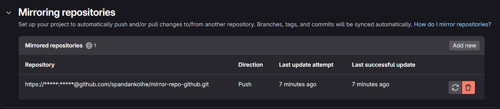
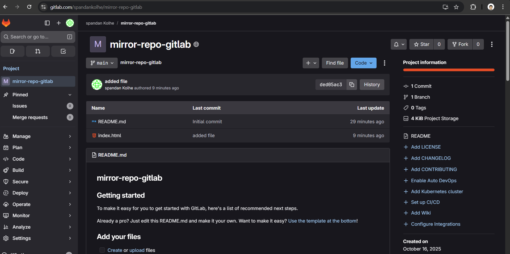
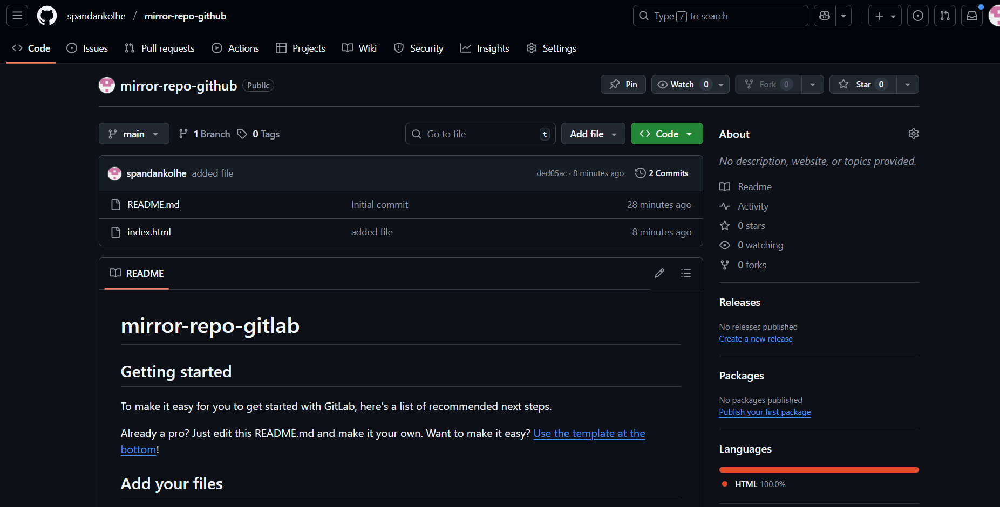

# 🌀 GitLab ↔ GitHub Repository Mirroring Project
## 📋 Overview

This mini-project demonstrates how to mirror (sync) a remote repository between GitLab and GitHub.
The goal was to automatically push changes made in one platform to another, ensuring both repositories stay in sync.




## ⚙️ What I Did

Created a new repository in GitLab and GitHub.

Configured push mirroring from GitLab → GitHub.

Verified that every commit or change made in GitLab was automatically reflected in GitHub.

Attempted to mirror GitHub → GitLab, but this requires a GitLab Premium feature, so reverted to one-way mirroring (GitLab → GitHub).

Documented the process and verified synchronization logs.

## 🧠 Learning Outcomes

Understood how remote repository mirroring works.

Learned how to configure SSH keys and repository URLs for synchronization.

Gained experience managing Git remotes and working with CI/CD-friendly workflows.

Understood GitLab’s free vs premium mirroring capabilities.

🪄 Commands / Steps Summary
## Add a new remote (GitHub) in GitLab repository
git remote add github https://github.com/username/repo-name.git

## Push code to both remotes
```
git push origin main

git push github main
```



## 📸 Project Status

✅ Completed (GitLab → GitHub mirroring)
❌ GitHub → GitLab mirroring (requires GitLab Premium)



🧩 Tools Used

Git

GitHub

GitLab

## 💡 Future Improvement

Use GitLab CI/CD or GitHub Actions to automate two-way sync using access tokens.